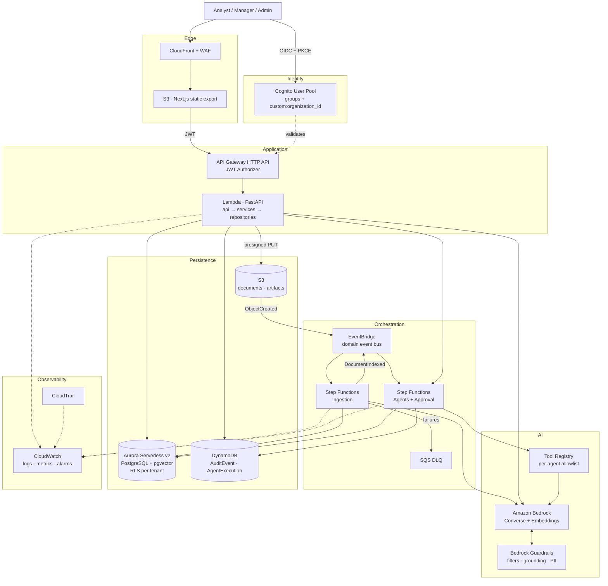
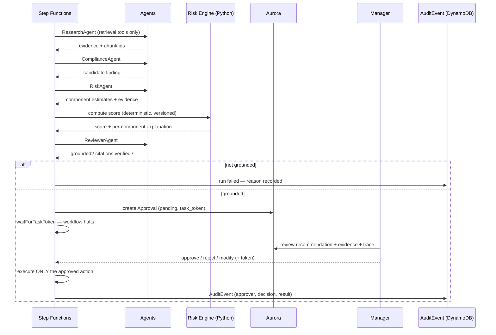

# CloudGuard AI — Phase 0: Architecture

**Agentic Audit & Compliance Intelligence Platform on AWS**

| | |
|---|---|
| Document | Phase 0 — Architecture & Planning |
| Status | Proposed (pre-implementation) |
| Date | 22 August 2026 |
| Author | Principal architect (planning session) |
| Supersedes | — |

> **Pricing note.** Every dollar figure in this document is an *estimate* built from publicly published AWS list prices for `us-east-1` as of August 2026. Public secondary sources disagree on several rates (Claude Haiku 4.5 is quoted at both $0.80 and $1.00 per million input tokens depending on the source; Aurora ACU rates vary by storage class). **Re-verify every rate against the official AWS pricing pages before you quote a number in a README, an interview, or a resume bullet.** Assumptions are labelled throughout.

---

## A. Executive Summary

CloudGuard AI is an enterprise compliance intelligence platform. An organisation uploads its governance corpus — policies, internal controls documentation, audit reports, vendor assessments, SOPs, ERP and transaction exports — and the platform turns that corpus into a queryable, evidence-linked compliance picture.

Concretely, the system does five things:

1. **Ingests and indexes** heterogeneous documents through an event-driven pipeline that extracts text, classifies the document, detects PII, chunks with structural awareness, embeds, and indexes for retrieval.
2. **Answers questions with citations.** A retrieval-augmented pipeline returns answers where every material claim points to a specific document, page, section, and chunk. When the corpus does not support an answer, the system says so rather than filling the gap.
3. **Detects compliance gaps.** Specialised agents compare evidence against stated policy and surface findings — a control that exists on paper but is contradicted by audit evidence, a missing control, a conflict between two policies.
4. **Scores and explains risk deterministically.** Findings are scored by application code using a weighted, versioned model. The LLM proposes component estimates *with evidence*; Python computes the number. The score is reproducible and auditable.
5. **Gates consequential actions behind a human.** Any action with real-world effect — escalating, closing an investigation, changing a severity, notifying management — pauses in a Step Functions workflow until a Manager approves, rejects, or modifies it. Every decision is written to a tamper-resistant audit log.

The differentiator versus a document chatbot is that **the AI is a proposer, not a decider.** Retrieval is authorisation-filtered, scoring is deterministic, citations are verified in code, and execution requires a human. That separation is the engineering thesis of the project and the thing worth defending in an interview.

**Deliberate non-goals for the MVP:** numeric/statistical anomaly detection over transaction data, real ERP or ticketing integrations, sophisticated multi-tenant onboarding, fine-tuned models, and OCR of scanned documents. Each is addressed in §D under V2/Future, and the architecture is designed not to preclude them.

---

## B. Business Problem

**The setting.** A mid-size regulated enterprise maintains hundreds of policy and control documents across departments, plus a continuous stream of audit reports and vendor assessments. Compliance obligations (SOX, SOC 2, ISO 27001, GDPR, HIPAA, sector-specific rules) require that stated controls actually match observed evidence.

**The failure mode.** The knowledge required to spot a gap is distributed across documents that no single person reads end to end. A policy says vendor accounts are disabled after 90 days of inactivity. A Q2 access audit, in a different document, notes that account V-104 was active for 173 days. Nobody joins those two facts until an external auditor does — at which point it is a finding, not a fix.

**Why this is expensive.** Internal audit teams spend the majority of their cycle on evidence gathering and cross-referencing rather than judgement. Findings surface late. Remediation is prioritised by whoever argues loudest rather than by consistent risk criteria. When the regulator asks *how* a conclusion was reached, the answer is a spreadsheet and someone's memory.

**Why generic AI does not solve it.** A general-purpose assistant will answer confidently from parametric memory, cannot cite the organisation's own documents, has no notion of who is allowed to see which document, and cannot be audited. In compliance, an unsourced answer is worse than no answer — it creates the appearance of diligence without the substance.

**What CloudGuard AI changes.** It makes the cross-document join automatic and evidence-linked, applies one consistent scoring model to every finding, keeps a human accountable for every consequential decision, and produces a reconstructable trail from a recommendation back through the agent that made it, the model that generated it, the chunks it retrieved, and the person who approved it.

**Value hypothesis (to be measured, not asserted):** reduce time-to-first-finding on a new document set, and produce a defensible audit trail as a by-product of normal operation rather than as a separate documentation exercise.

---

## C. Users

### C.1 Personas

**Compliance Analyst — primary user, highest volume**

Day job: reads documents, gathers evidence, drafts findings. Currently drowning in PDFs.

| Needs | Why it matters to the design |
|---|---|
| Ask questions across the whole corpus and get sourced answers | Drives the RAG pipeline and citation requirements |
| Know when the corpus *cannot* answer | Drives explicit insufficient-evidence handling; a confident wrong answer costs them credibility |
| Trace any claim to a page | Drives chunk-level provenance metadata |
| Upload a document and have it usable in minutes | Drives async ingestion with visible status |

Cannot: approve actions, change severities, see other departments' confidential documents.

**Compliance / Audit Manager — the accountable human**

Day job: reviews analyst work, decides what escalates, owns the outcome.

| Needs | Why it matters to the design |
|---|---|
| See what the AI proposed *and the evidence behind it* before approving | Drives the approval payload schema — recommendation + evidence + agent trace |
| Override or modify a recommendation, not just accept/reject | Drives a three-way approval decision, not a boolean |
| A portfolio view: what is critical, what is stale, who owns what | Drives dashboard aggregation queries |
| Confidence that approving is recorded as *their* decision | Drives immutable audit events with approver identity |

**Platform / Security Administrator**

| Needs | Why it matters to the design |
|---|---|
| Manage users, roles, and department scoping | Drives Cognito groups + custom claims |
| Configure guardrails, risk weights, feature flags | Drives configuration-as-data rather than hard-coding |
| Reconstruct any AI decision after the fact | Drives the audit event schema and retention policy |
| Watch cost and system health | Drives token/cost metrics as first-class telemetry |

**External Auditor (read-only, V2)** — the reason immutability matters. Sees a scoped, read-only view of findings and their evidence trail. Not in MVP, but the audit event schema is designed so this view is a query rather than a migration.

### C.2 Core user stories (MVP)

```
As an Analyst, I upload a policy PDF and see it move through
  QUEUED → EXTRACTING → INDEXING → READY, so I know when I can query it.

As an Analyst, I ask "what is our vendor access review policy?" and receive
  an answer where each claim links to a document, page, and section.

As an Analyst, I ask something the corpus does not cover and the system
  tells me the evidence is unavailable rather than inventing an answer.

As the system, I detect that audit evidence contradicts a stated control
  and raise a Finding with both sides of the contradiction attached.

As the system, I score that Finding using deterministic, versioned logic
  and show the contribution of each component to the total.

As a Manager, I review a pending AI recommendation alongside its evidence
  and agent trace, and approve, reject, or modify it.

As an Administrator, I open an audit event and reconstruct which agent,
  model, and retrieved chunks produced a given recommendation.

As an Analyst in Department A, I cannot retrieve Department B's
  confidential documents — and neither can any agent acting on my behalf.
```

That last story is a **security test in CI**, not a manual check.

---

## D. Core Features

### MVP — the demoable slice (Phases 1–7)

| Area | Scope |
|---|---|
| Auth | Cognito login/logout, JWT sessions, protected routes, three roles, server-enforced RBAC |
| Ingestion | PDF/DOCX/CSV/TXT/JSON upload → S3 → Step Functions pipeline → indexed; live status in UI |
| Retrieval | Hybrid dense + lexical retrieval, RRF fusion, authorisation-filtered, metadata-scoped |
| Generation | Bedrock via a provider abstraction; structured response with answer, sources, confidence, risk flags |
| Citations | Chunk-level provenance; deterministic post-generation citation verification |
| Findings | Compliance Agent produces findings with both sides of an evidence conflict |
| Risk | Deterministic weighted scoring, per-component explanation, versioned scoring model |
| Agents | Research, Risk, Reviewer first; then Compliance, Investigation, Remediation, Executive Summary |
| Human-in-loop | Approval queue, three-way decision, Step Functions task-token pause, audit events |
| UI | Login, Dashboard, Documents, AI Assistant, Risk Center, Investigations, Audit Logs |
| Ops | Structured JSON logging, CloudWatch metrics incl. token spend, CI with lint/type/test/scan |

### V2 — the credibility layer (Phases 8–12)

- Bedrock Guardrails: content filters, denied topics, PII filters, contextual grounding, prompt-attack filter
- **Automated Reasoning checks** — encode a subset of policy as a formal policy and get *provable* verification of whether a response complies. This is the single strongest differentiator available for a compliance product and is worth a section of the README on its own.
- Full evaluation harness: golden dataset, groundedness, citation accuracy, retrieval precision/recall, hallucination rate, adversarial suite — run nightly in CI with results charted in-app
- Second `VectorStore` adapter (S3 Vectors) plus a published benchmark against pgvector: recall@k, p95 latency, cost per million queries
- Analytics page: risks over time, by category, by department; agent success rate; cost per query
- Reranking behind a feature flag, with a measured before/after on retrieval precision
- Executive Summary agent producing the McKinsey-structured finding format (§B of the brief)
- Cross-tenant and prompt-injection security tests as blocking CI gates

### Future — architecture must not preclude, do not build now

Graph RAG and knowledge graphs · agent long-term memory · MCP-exposed tools · OCR and multimodal document understanding · Slack/Teams notification · Jira/ServiceNow ticket creation · automated remediation execution · statistical anomaly detection over transaction data · predictive risk forecasting · additional LLM providers · fine-tuning.

The four architectural commitments that keep these open: the `LLMProvider` and `VectorStore` ports, the EventBridge domain event bus, the tool-registry indirection in front of every agent capability, and `organization_id` on every row from day one.

---

## E. Architecture

### E.1 Shape

Six layers, each with one job:

```
Presentation   Next.js static export on S3 + CloudFront. No server-side rendering,
               no application secrets, no authorisation decisions.

Edge           CloudFront (+ WAF in V2). TLS, caching, basic rate limiting.

Identity       Cognito user pool. Issues JWTs carrying role and organization_id.
               API Gateway validates the token before any code runs.

Application    FastAPI on Lambda. api/ → services/ → repositories/.
               Business logic knows nothing about Bedrock, S3, or DynamoDB —
               only about ports defined in the domain.

Orchestration  Step Functions for anything multi-step or long-running:
               document ingestion, agent workflows, human approval pauses.
               EventBridge as the domain event bus between bounded contexts.

Persistence    Aurora Serverless v2 PostgreSQL (system of record + pgvector),
               DynamoDB (append-only audit and agent traces),
               S3 (raw documents, extracted text, evaluation artifacts).
```

The rule that keeps this clean: **`services/` may import from `models/` and from port interfaces; it may never import `boto3`.** Adapters live in `repositories/` and `integrations/`. This is what makes the whole application testable without an AWS account, which is the difference between a project you can iterate on nightly and one you can only touch when you are willing to pay.

### E.2 Request path — synchronous query

```
Browser
  → CloudFront
  → API Gateway (JWT authorizer: signature, issuer, audience, expiry)
  → Lambda / FastAPI
      → Principal built from claims (user_id, organization_id, role, department)
      → Query validation (length, encoding, injection heuristics)
      → Query transformation (expansion / decomposition)
      → Retrieval:
            dense  : pgvector cosine search, metadata-filtered
            lexical: Postgres tsvector full-text, same filter
            fusion : Reciprocal Rank Fusion
            filter : organization_id + confidentiality_level from the JWT — never from user input, never from model output
      → Optional rerank (feature-flagged)
      → Context assembly (token-budgeted, provenance preserved per chunk)
      → LLMProvider.generate() → Bedrock Converse API, structured output schema
      → Citation verification (deterministic, in Python)
      → Guardrail validation (Bedrock Guardrails, incl. contextual grounding)
      → Response + AuditEvent + metrics emitted
```

Every step before the LLM narrows what the model can possibly see. That ordering is the security design.

### E.3 Request path — asynchronous ingestion

```
Presigned S3 PUT (browser uploads directly; the API never proxies file bytes)
  → S3 ObjectCreated → EventBridge rule
  → Step Functions (Standard) "IngestionWorkflow"
        Validate      : size, MIME sniff, extension allowlist, malformed-archive check
        Extract       : text + structure (page, section, heading path)
        Classify      : document_type inference
        DetectPII     : Comprehend or Guardrails sensitive-info filter → tag, do not silently drop
        ScanInjection : flag imperative-instruction patterns → quarantine if score high
        Chunk         : structure-aware, with overlap; retain page/section on every chunk
        Embed         : Titan Text Embeddings V2, batched
        Index         : write chunks + vectors + tsvector
        Publish       : DocumentIndexed → EventBridge
  → Failures route to an SQS dead-letter queue with the failing state captured
```

**Why Step Functions rather than chained Lambdas.** Ingestion is a long, failure-prone, multi-step process where you need per-step retry policies, a visual execution history for debugging, and the ability to resume. Chaining Lambdas by invoking one from another gives you none of that and buries the state machine in code. The execution history is also, incidentally, an audit artifact.

**Why EventBridge sits between S3 and Step Functions.** Direct S3 → Step Functions works. EventBridge costs almost nothing and means that when you later want a notification, an analytics sink, or a second consumer, you add a rule instead of editing the producer. That is the entire argument for an event bus, and it only pays off if you put it in before you need it.

**Why SQS is present but minimal.** In the MVP it is a DLQ, not a work queue — Step Functions already handles retries and backpressure. Adding a queue in front of a state machine you control would be complexity without a job. If ingestion volume ever bursts past Bedrock embedding throughput limits, an SQS buffer in front of the Embed step becomes justified; that is a change to make when the metric says so.

### E.4 Request path — agentic investigation with human approval

```
Trigger (DocumentIndexed, or Analyst action)
  → Step Functions "InvestigationWorkflow"
        ResearchAgent      → retrieval only, no write tools
        ComplianceAgent    → compare evidence to policy, emit candidate findings
        RiskAgent          → emit component estimates + evidence (structured output)
        [Python]           → deterministic risk score, versioned
        ReviewerAgent      → groundedness + citation existence check, may fail the run
        [Choice]           → score ≥ threshold?  yes → request approval
        WaitForApproval    → .waitForTaskToken, pauses indefinitely
                              Manager decision arrives via POST /approvals/{id}/approve
        Execute            → the approved action, and only the approved action
        Audit              → AuditEvent written for every transition
```

The `.waitForTaskToken` callback pattern is what makes human-in-the-loop a first-class architectural element rather than a database flag someone polls. The workflow genuinely stops. It cannot proceed without a token that only an authorised Manager's API call can supply.

---

## F. AWS Services

Each row: what it does, why it is here, what was considered instead, and what it costs at demo scale. Services that were *considered and rejected* are listed at the end — that list is often the more interesting half of the conversation.

### F.1 Selected

| Service | Purpose | Why chosen | Alternative considered | Cost impact (demo) |
|---|---|---|---|---|
| **Amazon Bedrock** | Foundation model inference (generation + embeddings) | Managed, IAM-native, no key management, multiple model families behind one API, and Guardrails/Automated Reasoning attach to it | Direct Anthropic/OpenAI API — cheaper to start, but adds secret management, no IAM, no Guardrails, and weakens the "AWS-native" story | Dominant variable cost; ~$15–20/mo at 1k queries |
| **Bedrock Guardrails** | Content filters, denied topics, PII, contextual grounding, prompt-attack filter | A safety layer *outside* the prompt. Prompt-based safety is not a control; a separately-billed, separately-configured API is | Self-built filters — fine for word lists, no substitute for contextual grounding scoring | ~$0.15/1K text units (filters), ~$0.10/1K (grounding, PII) |
| **Bedrock Automated Reasoning checks** (V2) | Formal verification of responses against encoded policy | Turns "the model says this complies" into a mathematically verified verdict — verified / contradicted / indeterminate. Uniquely apt for compliance | LLM-as-judge — probabilistic, not provable | ~$0.17/1K text units per policy; region-gated, verify availability |
| **AWS Lambda** | FastAPI application compute | Scale-to-zero, per-ms billing, generous free tier. A demo that idles most of the month should cost nothing while idle | Fargate/App Runner — no cold starts, but a constant hourly floor | ~$0 within free tier |
| **API Gateway (HTTP API)** | Public API edge, JWT authorisation | Native Cognito JWT authorizer rejects unauthenticated requests *before* Lambda runs — cheaper and safer. ~70% cheaper than REST API | REST API (needed only for request validation models / API keys); ALB (hourly floor) | $1.00 per million requests |
| **Amazon Cognito** | Identity, groups, custom claims | Managed OIDC, hosted UI, group→role mapping, `custom:organization_id` claim. Integrates with API Gateway with zero code | Auth0/Clerk (cost, external dependency); DIY auth (never) | Free tier covers a demo — **verify current MAU tiering** |
| **Amazon S3** | Raw documents, extracted text, eval artifacts, static frontend | Durable, cheap, event-emitting, presigned uploads keep file bytes out of Lambda | EFS (needs VPC, hourly cost) | ~$0.12/mo for 5 GB |
| **Amazon S3 Vectors** (V2 adapter) | Second vector store for benchmarking | GA since Dec 2025, up to 2B vectors/index, ~100 ms warm queries, **no provisioned compute at all** — a true zero idle floor. Native Bedrock Knowledge Bases integration | Keeping only pgvector — but then the `VectorStore` port is never proven | Storage ~$0.06/GB-mo + per-request + per-TB scanned |
| **Aurora Serverless v2 (PostgreSQL) + pgvector** | System of record *and* MVP vector store | Relational because the dashboards are join-and-aggregate heavy. pgvector because it removes a whole system. **Row-Level Security gives a database-enforced tenant boundary** independent of application code | See §F.3 for the full vector-store comparison | ~$0.12/ACU-hr, **min 0 ACU auto-pause**; storage $0.10/GB-mo |
| **Amazon DynamoDB** | AuditEvent, AgentExecution traces | Append-only, high-write, queried by (org, time-range), never joined. On-demand billing, TTL, and — critically — **immutability enforceable via IAM by denying `UpdateItem`/`DeleteItem`**, which no relational grant does as cleanly | Postgres tables — simpler, but you lose IAM-level immutability and pay ACU for write bursts | <$1/mo on-demand at demo volume |
| **AWS Step Functions** | Ingestion pipeline; agent workflow; approval pause | Retries, error routing, visual execution history, and `.waitForTaskToken` for indefinite human pauses. Standard workflows retain full history (an audit artifact) | Orchestrating in Lambda code — invisible state, no resume, 15-min ceiling | Free tier 4,000 transitions/mo, then $0.025/1,000 |
| **Amazon EventBridge** | Domain event bus | Decouples producers from consumers. Adding a consumer becomes a rule, not a code change | Direct invocation / SNS (no content-based routing or schema registry) | $1.00 per million events |
| **Amazon SQS** | Dead-letter queues | Failure capture with replay | CloudWatch alarms alone (no payload retention) | Effectively $0 |
| **Amazon CloudFront** | CDN + TLS + edge for the SPA | Free-tier egress covers a demo; OAC keeps the S3 bucket private | S3 website hosting (no TLS on custom domain) | ~$0 within free tier |
| **AWS WAF** (V2) | Rate limiting, managed rule sets | Defence against volumetric abuse of an expensive endpoint | API Gateway throttling alone (no IP reputation / managed rules) | ~$5/mo + per-request; **enable late** |
| **CloudWatch** | Logs, metrics, alarms, dashboards | Native; EMF lets you emit structured logs that become metrics without a second call | Datadog/Grafana Cloud (external cost) | ~$0.50–2/mo with **7–14 day retention** |
| **CloudTrail** | Control-plane audit | Management events free; the "who touched the infrastructure" half of the audit story | — | $0 for management events |
| **AWS KMS** | Encryption keys with encryption context | Customer-managed key lets you scope decrypt by `organization_id` in the encryption context — a real tenant control, not a checkbox | SSE-S3 (no per-tenant context, no key policy) | $1/mo per CMK + request charges |
| **Secrets Manager** | Application secrets | Rotation, IAM-scoped, audited | SSM Parameter Store SecureString — **cheaper ($0 vs $0.40/secret/mo)**; use it if the budget is tight and rotation is not needed | $0.40/secret/mo |
| **AWS IAM** | Least-privilege everywhere | Per-Lambda roles, per-agent tool policies | — | $0 |
| **AWS CDK (Python)** | Infrastructure as code | Same language as the backend; L2 constructs encode sane defaults; `cdk diff` before every deploy | Terraform (better multi-cloud, larger job-market footprint) — see ADR-009 | $0 |

### F.2 Considered and rejected (for now)

| Service | Why not |
|---|---|
| **Amazon OpenSearch Serverless** | The classic objection (a ~$700/mo idle floor from a 4-OCU minimum) **no longer holds**: NextGen collections went GA in May 2026 with no minimum OCU and scale-to-zero after 10 minutes idle. It is now genuinely viable. It is still rejected for the MVP because it adds an operational surface for capability (native hybrid BM25 + vector, aggregations) that Postgres tsvector + RRF covers at this scale. **Revisit when the corpus exceeds roughly 10M chunks or lexical relevance measurably underperforms.** |
| **Bedrock AgentCore** | GA since October 2025; modular, consumption-based, harness itself free (Runtime ~$0.0895/vCPU-hr + ~$0.00945/GB-hr). It is the right answer for production agents needing sessions beyond Lambda's 15 minutes, managed memory, a browser tool, or Gateway-brokered tools. Rejected for the MVP because **the orchestration logic is the thing being demonstrated** — outsourcing it removes the interesting engineering. Phase 11 optionally deploys one agent to AgentCore Runtime purely as a comparison, which is a better interview answer than never having touched it. |
| **Bedrock Knowledge Bases** | Managed chunking, embedding, and retrieval. Excellent, and the right production default. Rejected for the same reason as AgentCore: building the RAG pipeline is the point. Worth wiring up in Phase 12 as a measured baseline — "my hand-built pipeline scored X vs managed KB's Y" is a strong claim if you have the numbers. |
| **Aurora DSQL** | Serverless distributed Postgres, scales to zero, ~$8.00 per million DPUs, free tier of 100k DPUs. Attractive. Rejected because it does not support the full PostgreSQL extension surface — **no pgvector, and RLS support must be verified** — and both are load-bearing here. |
| **Amazon Comprehend** | Managed PII detection. Reasonable, but Guardrails' sensitive-information filter covers the same need inside a component already in the stack. Add Comprehend only if you need entity types Guardrails lacks. |
| **Amazon Textract** | OCR for scanned documents. Genuinely needed for real audit corpora; deliberately deferred to Future because it multiplies ingestion cost and the synthetic sample data is born-digital. |
| **NAT Gateway** | See §M.3 — this is the single biggest avoidable cost in the whole design. |

### F.3 The vector store decision, in full

This is the most consequential and most misunderstood cost decision in any RAG project, so it gets its own treatment.

| Option | Idle floor | Strengths | Weaknesses | Verdict |
|---|---|---|---|---|
| **pgvector on Aurora Serverless v2** | **$0 compute** at `min_capacity = 0`, ~10–15 s resume; storage continues (~$0.10/GB-mo) | One system for metadata + vectors; transactional consistency; hybrid search in a single SQL query; RLS applies to vectors too | Cold-start latency; HNSW needs the working set in shared buffers, so it degrades past roughly 100M vectors at 1024 dims | **MVP primary** |
| **S3 Vectors** | **$0** — no provisioned compute exists | True zero floor; 2B vectors/index; ~100 ms warm; native Bedrock KB integration; storage ~$0.06/GB-mo | Query cost scales with *index size scanned*, not just call count, so it inverts at high QPS over large indexes; no lexical search | **Second adapter, Phase 11 benchmark** |
| **OpenSearch Serverless NextGen** | $0 after 10-min idle; ~$0.24/OCU-hr when active | Native hybrid lexical+vector, aggregations, the real production answer at scale | Operational surface; 10–30 s cold start per component on first request | **Documented scale path** |
| **OpenSearch Serverless Classic** | ~$350–700/mo idle (2–4 OCU floor) | — | The reason NextGen exists | **Do not start here** |
| **Pinecone** | Starter free; Standard carries a ~$50/mo minimum | Good DX | Leaves AWS, weakens the story, external secret | **No** |

**Decision:** ship pgvector, build the `VectorStore` port properly, then implement S3 Vectors as a real second adapter and publish a benchmark. Two working adapters prove the abstraction; one adapter plus an interface proves nothing. The benchmark itself is a resume artifact.

**Honest caveat.** Dense retrieval alone is weak on exact identifiers — `AC-2`, `V-104`, `ISO 27001 A.9.2.5` — which are precisely the tokens that matter in compliance work. This is why hybrid retrieval is in the MVP rather than deferred: Postgres `tsvector` full-text search alongside pgvector, fused with Reciprocal Rank Fusion. If retrieval quality on identifier-style queries is still poor after Phase 4, that is the signal to move to OpenSearch NextGen, and the evaluation harness in Phase 9 is what will tell you.

---

## G. AI Architecture

### G.1 RAG — the pipeline, and why each stage exists

| Stage | What it does | Why it is not optional |
|---|---|---|
| Query validation | Length, encoding, control characters, injection heuristics | Cheapest possible rejection point |
| Authorisation resolution | Build the retrieval filter from JWT claims | The filter must originate in the token, never in the request body |
| Query transformation | Expansion, decomposition of multi-part questions | User questions are rarely shaped like the corpus |
| Dense retrieval | pgvector cosine, top-k with metadata filter | Semantic recall |
| Lexical retrieval | Postgres `tsvector`, same filter | Exact identifiers, control numbers, policy section refs |
| Fusion | Reciprocal Rank Fusion | Neither channel dominates; no score-scale calibration needed |
| Rerank (flagged) | Cross-encoder reorder of the fused set | Precision@k, measured before/after |
| Context assembly | Token-budgeted packing, provenance preserved per chunk | The model cannot cite what it cannot see, and cannot see what does not fit |
| Generation | Bedrock Converse, structured output schema | Schema-constrained output makes parsing deterministic |
| Citation verification | **Python, not the model** | See §G.2 |
| Guardrail validation | Bedrock Guardrails incl. contextual grounding | An independent check that is not the same model marking its own work |

**Fine-tuning is not in scope, and the reason is worth stating precisely** (it is a near-certain interview question): compliance corpora change weekly, and answers must be traceable to a specific current document. Fine-tuning bakes knowledge into weights where it cannot be cited, cannot be updated per-document, and cannot be authorisation-filtered per user. RAG keeps knowledge in a store you can query, secure, version, and delete on request. Fine-tuning would be appropriate for *format* or *domain register* — not for facts.

### G.2 Citation verification

The model proposes citations. Application code verifies them:

1. Every `chunk_id` in the response must exist in the set actually retrieved for this request. Not "in the corpus" — **in this request's retrieval set.** A hallucinated-but-real chunk id fails.
2. The cited chunk must be within the caller's authorisation scope, re-checked at verification time.
3. The answer span must exceed a similarity threshold against the cited chunk (lexical overlap plus embedding similarity).
4. Failures are stripped and the claim is downgraded, not silently kept.
5. `confidence` is computed from retrieval scores, citation verification rate, and the contextual grounding score — **never generated by the model.** A model-reported confidence number is a fluent guess.

This is the concrete answer to "how did you prevent hallucinations?" — you did not prevent them, you made them detectable and non-silent.

### G.3 Agents

Seven specialised agents, not one. Each has a narrow prompt, a narrow tool allowlist, and its own IAM role.

| Agent | Tools it may call | Tools it explicitly cannot |
|---|---|---|
| Research | `search_documents`, `get_chunk` | Anything that writes |
| Compliance | `search_documents`, `get_policy` | Write, notify, score |
| Risk | `get_finding`, `get_evidence` | Write the score — it emits *estimates*; Python computes |
| Investigation | `search_documents`, `list_stakeholders`, `create_investigation_draft` | Assign owners, notify |
| Remediation | `get_risk`, `propose_action` | Execute any action |
| Executive Summary | `get_findings` | Everything else |
| Reviewer | `get_retrieved_chunks`, `get_response` | Every write tool — and it can **fail the workflow** |

**Least privilege for agents, concretely.** The LLM never receives credentials or a raw tool endpoint. It emits a tool-call intent. A `ToolRegistry` resolves the intent against (a) the agent's static allowlist and (b) the *original human caller's* Principal. Both must pass. This means text embedded in an uploaded document cannot escalate anything: even if it convinces the model to request `send_email`, the Compliance Agent has no such tool and the registry rejects the call before any code executes.

**Orchestration is deterministic, not emergent.** Agents are Step Functions states in a defined graph. There is no free-form agent-to-agent chat, no dynamic delegation. Multi-agent systems where agents decide who to call next are impressive in demos and unauditable in compliance. A fixed graph with specialised nodes is the defensible choice, and "I deliberately did not build emergent multi-agent orchestration, here is why" is a stronger interview answer than having built it.

**Model routing by task** (all IDs configurable, never hard-coded):

| Task | Model class | Rationale |
|---|---|---|
| Classification, routing, extraction | Nova Micro / Lite (~$0.035–0.06 per M input) | Cheap and sufficient |
| Standard RAG answering | Claude Haiku 4.5 (~$1/$5 per M) | Quality/cost sweet spot |
| Compliance reasoning, exec summary | Claude Sonnet class (~$3/$15 per M) | Worth the premium on the hardest reasoning |
| Reviewer / LLM-as-judge | **A different family from the generator** | Reduces self-preference bias |
| Embeddings | Titan Text Embeddings V2 (~$0.02 per M input) | Cheap; 256/512/1024 dims configurable |

Cost levers to build in from the start: prompt caching on the stable system-prompt prefix (up to ~90% off cached input), batch inference (~50% off) for evaluation runs and bulk classification, and a hard per-request token ceiling.

### G.4 Human approval

Consequential actions never execute from a model decision. The workflow pauses on `.waitForTaskToken`; the token is stored against an `Approval` row; a Manager's authenticated call supplies it. The approval payload always carries: the recommendation, the evidence, the agent trace, the model and version used, and the deterministic score with its component breakdown. Approving with less than that is rubber-stamping, and the UI should make that hard.

### G.5 Evaluation

A golden dataset of ~50 question/answer pairs over the synthetic corpus, spanning: answerable, unanswerable, ambiguous, cross-document, unauthorised, and prompt-injection cases. Metrics: answer relevance, context relevance, retrieval precision/recall, groundedness, citation accuracy, hallucination rate, unsafe-response rate, tool-call success, agent-task completion, p50/p95 latency, cost per request.

Runs nightly in GitHub Actions against a dev deployment, writes an `EvaluationRun` row, charts in the Analytics page. **The adversarial subset is a blocking CI gate** — a regression that leaks a cross-tenant document fails the build. The quality metrics are reported, not blocking, because they are noisy.

---

## H. Data Architecture

### H.1 Store selection

| Store | Holds | Why this store |
|---|---|---|
| **Aurora Serverless v2 (Postgres) + pgvector** | Organization, User, Document, DocumentChunk (+ embedding + tsvector), Conversation, Message, Finding, Risk, Investigation, Recommendation, Approval, EvaluationRun | Dashboards are aggregate-and-join workloads (risks by department over time, investigations by status with owner). These are trivial SQL and painful in a document store. RLS provides a second, DB-enforced tenant boundary. |
| **DynamoDB** | AuditEvent, AgentExecution | Append-only, high write volume, queried by partition + time range, never joined, benefits from TTL. Immutability is enforceable at the IAM layer by denying `UpdateItem` and `DeleteItem` on the table. |
| **S3** | Raw uploads, extracted text, evaluation artifacts, exported reports | Bytes. Versioning + Object Lock available if you want WORM guarantees on evidence. |

**The general rule, stated for the interview:** DynamoDB when the access pattern is known, singular, and high-volume; relational when the query shape is not known in advance. Compliance dashboards are the definition of "query shape not known in advance" — a Manager will ask for a slice you did not anticipate. Audit logs are the definition of a known access pattern.

### H.2 Entity map

Every table carries `organization_id`. Every table carries `created_at`/`updated_at`.

| Entity | Store | PK | Key indexes | Retention |
|---|---|---|---|---|
| Organization | PG | `id` uuid | — | Indefinite |
| User | PG | `id` uuid (= Cognito sub) | `(organization_id, email)` unique | Indefinite; soft-delete |
| Document | PG | `id` uuid | `(organization_id, processing_status)`, `(organization_id, document_type)`, GIN on `tags` | Policy-driven; default 7y |
| DocumentChunk | PG | `id` uuid | HNSW on `embedding`, GIN on `tsv`, `(document_id, chunk_index)` | Cascades from Document |
| Conversation | PG | `id` uuid | `(organization_id, user_id, updated_at DESC)` | 1y |
| Message | PG | `id` uuid | `(conversation_id, created_at)` | 1y |
| Finding | PG | `id` uuid | `(organization_id, status)`, `(organization_id, detected_at DESC)` | 7y |
| Risk | PG | `id` uuid | `(organization_id, classification, score DESC)`, `(organization_id, department)` | 7y |
| Investigation | PG | `id` uuid | `(organization_id, status)`, `(owner_id, status)` | 7y |
| Recommendation | PG | `id` uuid | `(risk_id)`, `(organization_id, priority)` | 7y |
| Approval | PG | `id` uuid | `(organization_id, decision)` partial on NULL, `(task_token)` unique | 7y |
| EvaluationRun | PG | `id` uuid | `(created_at DESC)` | 2y |
| **AuditEvent** | **DDB** | PK `ORG#{org}` SK `{ts}#{ulid}` | GSI1 `USER#{user}` / ts; GSI2 `RESOURCE#{type}#{id}` / ts | TTL 7y |
| **AgentExecution** | **DDB** | PK `EXEC#{workflow_execution_id}` SK `{step}#{ts}` | GSI1 `ORG#{org}` / ts | TTL 1y |

### H.3 Selected schemas

**DocumentChunk** — provenance is the whole point:

```
id                uuid PK
organization_id   uuid  NOT NULL          -- RLS predicate
document_id       uuid  FK → Document
chunk_index       int                     -- ordinal within document
content           text
page_number       int                     -- citation target
section_path      text[]                  -- e.g. {'4. Access Control','4.2 Reviews'}
char_start, char_end  int                 -- exact span in extracted text
token_count       int
embedding         vector(1024)            -- Titan V2
tsv               tsvector GENERATED      -- lexical channel
embedding_model   text                    -- reindex trigger on model change
confidentiality_level  text               -- inherited; part of the retrieval filter
```

Storing `embedding_model` per chunk means a model upgrade is a detectable, incremental reindex rather than a silent quality regression — a small field that prevents a genuinely nasty class of bug.

**Risk** — the score is data, and so is the model that produced it:

```
id                     uuid PK
organization_id        uuid NOT NULL
finding_id             uuid FK
business_impact        int    -- 1..10, each with its own evidence reference
likelihood             int
compliance_severity    int
urgency                int
evidence_confidence    int
score                  numeric(5,2)  -- COMPUTED IN PYTHON, never by the LLM
classification         text          -- CRITICAL | HIGH | MEDIUM | LOW
scoring_version        text          -- 'v1.0' — makes historical scores reproducible
explanation            jsonb         -- per-component contribution + evidence chunk ids
```

`scoring_version` is what lets you change the weights next quarter without invalidating last quarter's scores. In a compliance product that is not a nice-to-have.

**AuditEvent** — designed so the question "how did this recommendation happen?" is one query:

```
pk, sk, organization_id, actor_id, actor_type (human|agent|system),
action, resource_type, resource_id, session_context,
agent_name, model_id, tool_used, retrieved_chunk_ids[],
recommendation_id, approval_id, execution_result, ttl
```

---

## I. Security Architecture

### I.1 Authentication and authorisation

Cognito issues a JWT carrying `sub`, `cognito:groups` (analyst/manager/admin), `custom:organization_id`, and `custom:department`. API Gateway's JWT authorizer validates signature, issuer, audience, and expiry **before Lambda is invoked** — unauthenticated traffic never reaches application code or incurs Bedrock cost.

Inside FastAPI, a `Principal` dependency parses claims into a typed object. Every service method takes a `Principal`. Every repository method takes a `Principal`. There is no code path that queries data without one — enforce this with a lint rule if necessary.

**Frontend authorisation is presentation only.** Hiding the Approve button is UX. The server re-checks role on every call, and an authorisation test suite asserts that each role receives 403 on every endpoint it should not reach. That suite is a CI gate.

### I.2 Tenant isolation — four independent layers

1. **Token** — `organization_id` comes from the signed JWT, never from a request parameter.
2. **Application** — repositories inject the predicate; a query without it is a lint failure.
3. **Database** — `SET LOCAL app.current_org` per transaction, with Postgres RLS policies on every table. A bug in layer 2 still cannot cross tenants.
4. **Retrieval** — the vector and lexical filters are constructed server-side from the Principal. **Model output never influences the filter.**

Layer 3 is the one worth talking about in an interview: it is the difference between "I filter by tenant" and "the database refuses to return other tenants' rows even if my code is wrong."

### I.3 AI-specific security

**Prompt injection.** Assume every uploaded document is hostile.

| Control | Where |
|---|---|
| Retrieved content is wrapped in delimited, nonce-tagged blocks and never placed in the system prompt | Context assembly |
| System prompt states explicitly that document content is data, not instruction | Prompt template |
| Tool calls are authorised against the agent allowlist **and the human caller's Principal** | ToolRegistry |
| Retrieved text cannot originate a tool call — tools are available in planning turns, not synthesis turns | Orchestrator |
| Ingestion flags imperative-instruction patterns; high scores quarantine for admin review | Ingestion pipeline |
| Guardrails prompt-attack filter on input | Bedrock |
| Output scanned for PII and unverified citations before it leaves | Response pipeline |
| ~20 poisoned documents in `tests/security/injection_corpus/`; test asserts zero unauthorised tool calls and zero cross-tenant retrieval | CI, blocking |

The design principle: **prompts are not a security boundary.** Every control above works even if the model is fully persuaded.

**Data exposure.** PII detected at ingestion is tagged, not silently dropped — a compliance platform that quietly discards evidence is worse than useless. Confidentiality level is a retrieval filter, not a display filter. KMS encryption context includes `organization_id`.

### I.4 Infrastructure security

Per-Lambda IAM roles scoped to specific resource ARNs (no `Resource: "*"`, no `bedrock:*`). Encryption at rest via KMS CMK everywhere; TLS 1.2+ in transit. Secrets in Secrets Manager or SSM SecureString — never in code, never in the CDK source. `gitleaks` in pre-commit and CI, `pip-audit` and `npm audit` in CI, Trivy on any container image, GitHub secret scanning and Dependabot on. Rate limiting at API Gateway from day one and WAF in V2.

`SECURITY.md` and `docs/THREAT_MODEL.md` are written in Phase 8 and must include the **known limitations** section honestly — for example, that a static SPA cannot store tokens in httpOnly cookies, so XSS remains the primary token-theft vector, mitigated by CSP and short token lifetimes. A threat model that lists no residual risk is a threat model nobody believes.

---

## J. Repository Structure

```
cloudguard-ai/
├── frontend/
│   ├── src/
│   │   ├── app/                    # Next.js App Router
│   │   │   ├── (auth)/login/
│   │   │   └── (dashboard)/
│   │   │       ├── dashboard/  documents/  assistant/
│   │   │       ├── risks/      investigations/
│   │   │       ├── analytics/  audit/  settings/
│   │   ├── components/{ui,charts,documents,assistant,risks}/
│   │   ├── lib/{api-client,auth,types}/
│   │   └── hooks/
│   └── package.json
│
├── backend/
│   ├── app/
│   │   ├── main.py                 # FastAPI app factory
│   │   ├── lambda_handler.py       # Mangum adapter
│   │   ├── api/v1/                 # routers — thin, no business logic
│   │   ├── core/                   # config, logging, errors, deps, feature flags
│   │   ├── models/                 # Pydantic domain models + enums
│   │   ├── ports/                  # ← the abstraction boundary
│   │   │   ├── llm_provider.py         generate() / embed()
│   │   │   ├── vector_store.py         upsert() / search()
│   │   │   ├── document_store.py
│   │   │   └── event_publisher.py
│   │   ├── adapters/               # ← the ONLY place boto3 appears
│   │   │   ├── bedrock/  pgvector/  s3_vectors/  s3/  eventbridge/
│   │   │   └── mock/                   # fixture-backed, for local + CI
│   │   ├── services/               # business logic — imports ports, never boto3
│   │   ├── repositories/           # persistence, Principal-scoped
│   │   ├── rag/                    # chunking, retrieval, fusion, context, citations
│   │   ├── agents/
│   │   │   ├── base.py  registry.py  tools/
│   │   │   └── {research,compliance,risk,investigation,remediation,exec_summary,reviewer}.py
│   │   ├── risk_engine/            # deterministic scoring — pure functions, no I/O
│   │   ├── workflows/              # Step Functions task handlers
│   │   ├── security/               # authz, tenancy, injection detection, PII
│   │   ├── evaluations/            # harness, metrics, judges
│   │   └── utilities/
│   ├── tests/{unit,integration,security,evaluation}/
│   ├── pyproject.toml
│   └── Dockerfile
│
├── infrastructure/                 # AWS CDK (Python)
│   ├── app.py
│   └── stacks/{network,identity,data,api,ai,workflow,frontend,observability}_stack.py
│
├── sample-data/
│   ├── policies/  audits/  transactions/
│   ├── injection-corpus/           # deliberately hostile documents
│   └── generate.py                 # regenerates the corpus deterministically
│
├── evals/
│   ├── golden_dataset.jsonl
│   └── adversarial.jsonl
│
├── docs/
│   ├── architecture/
│   │   ├── 00-phase0-architecture.md    ← this document
│   │   └── diagrams/
│   ├── adr/                        # ← ADR-001…N, one per real decision
│   ├── API.md  SECURITY.md  THREAT_MODEL.md
│   ├── COST_ANALYSIS.md  AI_EVALUATION.md
│   └── INTERVIEW_NOTES.md
│
├── scripts/{seed_data,run_evals,local_setup}.sh
├── .github/workflows/{ci,nightly-eval,deploy-dev}.yml
├── docker-compose.yml  .env.example  .gitignore
├── CONTRIBUTING.md  LICENSE  README.md
```

**Three additions to the structure in your brief, each earning its place:**

- **`ports/` and `adapters/`** separated from `services/`. Your brief asked for an `LLMProvider` abstraction; making it a directory with a sibling `adapters/mock/` is what turns the abstraction from decoration into the thing that makes local development free.
- **`docs/adr/`** — Architecture Decision Records. Your §45 asks to track decisions for interviews and your §41.9 says never silently change architecture. An ADR log satisfies both mechanically: one short file per decision (context, options, choice, consequences), written *when* you decide. This is also, on its own, a strong GitHub signal — very few portfolio repos have one.
- **`evals/`** hoisted out of `backend/` because the datasets are project assets, not backend code, and you will want to version them independently.

---

## K. Local Development Strategy

The constraint: you should be able to develop for hours without an AWS bill and without a network connection.

### K.1 What runs locally

```yaml
# docker-compose.yml
postgres:    pgvector/pgvector:pg16     # Aurora + pgvector stand-in
localstack:  S3, DynamoDB, SQS, EventBridge, Step Functions, Secrets Manager
minio:       (optional) if LocalStack S3 events prove flaky
```

`scripts/local_setup.sh` creates tables, seeds the sample corpus, and starts `uvicorn --reload` plus `next dev`.

### K.2 Bedrock has no local emulator — so plan for it

This is the real problem, and the answer is the `LLMProvider` port. Three implementations:

| Provider | Use | Cost |
|---|---|---|
| `MockLLMProvider` | Deterministic canned responses keyed by prompt hash. Unit tests, offline work. | $0 |
| `RecordedLLMProvider` | VCR-style cassettes. Record real Bedrock responses once; replay forever. Integration tests get realistic output with byte-identical determinism. | $0 after recording |
| `BedrockLLMProvider` | Real inference. `ENV=dev` and above. | Real |

`RecordedLLMProvider` is the one that matters. It makes the AI pipeline testable in CI, makes tests deterministic (LLM output is not, and non-deterministic tests get disabled, and disabled tests rot), and lets you refactor the RAG pipeline at 1 a.m. for free. Re-record cassettes deliberately, and diff them — a cassette diff is a visible record of how a prompt change altered behaviour.

The same three-way pattern applies to `VectorStore`: in-memory numpy for unit tests, local pgvector for integration, Aurora or S3 Vectors in AWS.

### K.3 What you cannot fake, and when to pay

Cognito JWT validation, Bedrock Guardrails behaviour, Step Functions `.waitForTaskToken` timing, and IAM policy evaluation all need real AWS. Budget a small always-on dev environment (§M) and use it deliberately — write the code locally against mocks, then verify against dev in a batch rather than deploying to iterate.

### K.4 Cost hygiene from day one

Set an AWS Budget alert at $20 and $50 **before** the first `cdk deploy`. Tag every resource `Project=cloudguard-ai`. Put a `make destroy-dev` in the Makefile and use it. CloudWatch log retention defaults to *never expire* — override to 7 days in the CDK construct and never think about it again.

---

## L. Deployment Strategy

Two environments, three if you have the appetite.

| | `local` | `dev` (AWS) | `prod` (optional) |
|---|---|---|---|
| Purpose | Daily work | Demo, screenshots, nightly evals | Only if you want the multi-account story |
| Compute | Docker + uvicorn | Lambda | Lambda |
| Data | pgvector container | Aurora Serverless v2, `min=0` | Aurora, `min=0.5` |
| LLM | Mock / Recorded | Bedrock (cheap models) | Bedrock |
| Deploy | `docker compose up` | GitHub Actions on merge to `main` | Manual approval gate |
| Log retention | — | 7 days | 30 days |

**CI/CD** (`.github/workflows/ci.yml`), on every PR:

```
Lint (Ruff, ESLint, Prettier)
  → Type check (mypy --strict, tsc --noEmit)
  → Unit tests (pytest, coverage gate)
  → Security tests (authz matrix, injection corpus, cross-tenant)  ← blocking
  → Dependency + secret scan (pip-audit, npm audit, gitleaks)
  → Build (frontend export, backend package)
  → cdk synth + cdk diff  ← posted as a PR comment
```

On merge to `main`, add `cdk deploy` to dev via **GitHub OIDC federation to an IAM role — no long-lived AWS keys in GitHub secrets.** This is a small detail that experienced reviewers notice immediately.

A separate nightly workflow runs the evaluation suite against dev and writes an `EvaluationRun`.

---

## M. Estimated Monthly Cost

**All figures: `us-east-1` list prices as of August 2026, from public sources that partially disagree. Verify before quoting.**

### M.1 Three scenarios

| Line item | Demo (~100 queries) | 1,000 queries/mo | 10,000 queries/mo |
|---|---|---|---|
| Bedrock generation (Haiku 4.5 @ ~$1/$5 per M) | ~$1 | ~$7 | ~$70 |
| Bedrock agentic workflows (~6 calls each) | ~$1 | ~$8 | ~$80 |
| Bedrock embeddings (Titan V2 @ ~$0.02/M) | <$1 | <$1 | ~$2 |
| Guardrails (filters + grounding + PII) | <$1 | ~$2 | ~$21 |
| Aurora Serverless v2 (`min=0`, ~40 active ACU-hr) | ~$5 | ~$7 | ~$25 |
| Aurora storage (10 GB) | ~$1 | ~$1 | ~$2 |
| DynamoDB on-demand | <$1 | <$1 | ~$2 |
| Lambda | $0 (free tier) | $0 | ~$2 |
| API Gateway HTTP API | <$1 | <$1 | <$1 |
| Step Functions | $0 (free tier) | <$1 | ~$3 |
| S3 (5 GB) + CloudFront | <$1 | <$1 | ~$2 |
| CloudWatch (7-day retention) | ~$1 | ~$1 | ~$4 |
| KMS CMK | $1 | $1 | $1 |
| Secrets Manager (2 secrets) | $0.80 | $0.80 | $0.80 |
| Cognito | free tier — **verify current MAU tiering** | — | — |
| **Estimated total** | **~$12–18** | **~$30–45** | **~$210–260** |

### M.2 The two settings that dominate the bill

**Aurora `min_capacity`.** At `0`, compute bills only when active and the demo costs a few dollars. At `0.5`, you pay `0.5 × 730 × $0.12 ≈ $44/month` **whether or not anyone uses it.** The trade-off is a 10–15 second resume on the first query after idle. For a portfolio demo, `min=0` is correct — but add a lightweight "warming up" state in the UI, because a recruiter clicking your live demo and waiting 15 seconds with no feedback will assume it is broken. That UX detail is itself worth a line in the README.

**Never provision a NAT Gateway.** At ~$32/month plus data processing, a NAT Gateway would be the largest line item in the demo tier — larger than all AI spend combined. Avoid it by keeping Lambda **outside the VPC** and reaching Aurora through the **Aurora Data API** (an HTTPS endpoint, no VPC connectivity or connection pooling needed). S3 and DynamoDB reach via free Gateway endpoints if you ever do move into a VPC.

> **Validate in Phase 4:** confirm that pgvector operations work cleanly through the Data API — vector literals need explicit `::vector` casts in parameter binding, and result serialisation of the `vector` type should be avoided (return ids and scores, not embeddings). If it proves awkward, the fallback is Lambda in private subnets with Interface VPC endpoints for Bedrock and Secrets Manager (~$7.20/mo each) plus RDS Proxy — still no NAT. Record whichever way it goes as an ADR.

### M.3 Cost levers to build in from the start

Prompt caching on the stable system-prompt prefix (up to ~90% off cached input, 1-hour TTL available on current Claude models) · batch inference at ~50% off for evaluation runs and bulk classification · Nova Micro for classification instead of defaulting to a frontier model · a hard token ceiling per request · `ENABLE_*` feature flags so expensive paths (reranking, automated reasoning, agentic workflows) are off unless you are demonstrating them.

Emit `estimated_cost_usd` as a CloudWatch metric on every LLM call. It costs nothing to add and it turns "how would you reduce AWS cost?" from a hypothesis into a chart.

---

## N. Development Roadmap

Sized for a working student between now and December 2026 — roughly 15 weeks. **Phases 1–5 are the demoable slice.** Get there first; everything after is depth on a thing that already works.

| Phase | Weeks | Deliverable | Done when |
|---|---|---|---|
| **1 — Foundation** | 1 | Repo, backend + frontend skeletons, config, logging, ports/adapters, docker-compose | `docker compose up` runs; `/health` returns; tests pass |
| **2 — Auth** | 1 | Cognito, login/logout, protected routes, RBAC, authz test matrix | Analyst gets 403 on every manager endpoint, proven by test |
| **3 — Ingestion** | 1.5 | Presigned upload, S3, Step Functions pipeline, extraction, status UI | PDF → READY, visible progress, failures land in DLQ |
| **4 — RAG** | 2 | Chunking, embeddings, hybrid retrieval, RRF, Bedrock, citations, Assistant UI | Answers cite page + section; unanswerable questions say so |
| **5 — Risk engine** | 1.5 | Findings, deterministic scoring, explainability, Risk Center + dashboard | Score reproduces exactly from stored components |
| | | **← Demoable. Take screenshots. Add to resume.** | |
| **6 — Agents** | 2 | Research → Risk → Reviewer, then the rest; tool registry; Step Functions graph | Reviewer can fail a run; tool registry rejects out-of-scope calls |
| **7 — Human approval** | 1 | Approval queue, three-way decision, task tokens, audit trail | Workflow genuinely blocks until a Manager decides |
| **8 — Security** | 1.5 | Guardrails, injection defences, PII, rate limiting, SECURITY.md, THREAT_MODEL.md | Injection corpus passes; authz matrix green in CI |
| **9 — Evaluation** | 1.5 | Golden dataset, metrics, adversarial suite, nightly run, eval dashboard | You have **real measured numbers** |
| **10 — Observability** | 1 | Structured logs, metrics, alarms, cost tracking, CloudWatch dashboard | Cost per query visible on a chart |
| **11 — DevOps** | 1 | CDK complete, CI/CD, OIDC deploy, S3 Vectors adapter + benchmark | `cdk deploy` from scratch reproduces the environment |
| **12 — Polish** | 1 | README, diagrams, demo walkthrough, ADR review, interview notes, resume bullets | A stranger can clone, run, and understand it |

**If time compresses, cut in this order:** Phase 11's S3 Vectors benchmark, then the Investigation/Remediation/Exec-Summary agents, then Automated Reasoning checks. **Do not cut Phase 9.** Measured evaluation numbers are the difference between "I built a RAG app" and "I built a RAG app and here is its groundedness score" — and that difference is most of the interview value.

---

## O. Architecture Diagram

### O.1 System architecture



### O.2 Human-in-the-loop approval



---

## P. Technology Decisions

Each becomes an ADR in `docs/adr/`. Write them as you decide, not afterwards.

| ADR | Decision | Core reason | What you gave up |
|---|---|---|---|
| 001 | RAG over fine-tuning | Corpus changes weekly; answers must cite a current document and be authorisation-filtered per user | Domain-register adaptation |
| 002 | pgvector first, S3 Vectors second | Fewest moving parts; second adapter proves the port and produces a benchmark | Single-store simplicity |
| 003 | Postgres as system of record, DynamoDB for audit | Dashboards are unpredictable joins; audit is a known, append-only pattern with IAM-enforceable immutability | Operating two stores |
| 004 | Custom orchestration over AgentCore | The orchestration logic is the artifact being demonstrated | Managed sessions, memory, browser tool |
| 005 | Deterministic risk scoring in Python | Reproducible, auditable, versioned; the LLM proposes estimates, code computes | LLM's holistic judgement of severity |
| 006 | Fixed agent graph, no emergent delegation | Auditability; a compliance decision must be reconstructable | Flexibility on unanticipated tasks |
| 007 | Hybrid retrieval from the MVP | Dense retrieval is weak on `AC-2`, `V-104`, `ISO 27001 A.9.2.5` — exactly the tokens that matter here | Simplicity of a single retrieval channel |
| 008 | Lambda outside VPC + Aurora Data API | Avoids a ~$32/mo NAT Gateway that would exceed all AI spend | VPC-private data path (documented as a prod change) |
| 009 | CDK (Python) over Terraform | Same language as the backend; `cdk diff` in PRs; L2 constructs | Terraform's larger job-market footprint — *if postings you target name Terraform, switch; the architecture is unaffected* |
| 010 | Citation verification in code | The model proposing and validating its own citations is not a control | Some recall (over-strict verification drops valid citations) |
| 011 | `RecordedLLMProvider` cassettes | Deterministic, free CI for the AI pipeline; non-deterministic tests get disabled and rot | Cassette maintenance on prompt changes |
| 012 | Static SPA over Next.js SSR | No server compute for the frontend; ~$0.50/mo | httpOnly cookie storage — documented as residual XSS risk |

---

## Q. Learning Outcomes

| Phase | What you will actually be able to explain afterwards |
|---|---|
| 1 | Why ports and adapters make a cloud application testable, and what "the service layer must not import boto3" buys you |
| 2 | OIDC/JWT mechanics, why the API Gateway authorizer runs before Lambda, and why frontend authorisation is not authorisation |
| 3 | Event-driven ingestion, presigned uploads, why Step Functions beats chained Lambdas, and what a DLQ is actually for |
| 4 | Embeddings and vector similarity; why dense retrieval fails on identifiers; RRF; why RAG is not fine-tuning; chunking as a design decision, not a parameter |
| 5 | Why deterministic scoring beats asking the model for a number, and why `scoring_version` matters in a regulated product |
| 6 | Tool calling, least-privilege agent design, and why a fixed graph is more defensible than emergent multi-agent orchestration |
| 7 | The task-token callback pattern, and why human approval is an architectural element rather than a database flag |
| 8 | Why prompts are not a security boundary; defence in depth for AI; how to write a threat model that admits residual risk |
| 9 | How to actually measure a RAG system — groundedness, citation accuracy, retrieval precision — and why LLM-as-judge needs a different model family |
| 10 | Structured logging, EMF, and treating token spend as a first-class metric |
| 11 | Reproducible infrastructure, OIDC federation instead of stored AWS keys, and a real vector-store benchmark |
| 12 | Explaining all of the above to someone who has ten minutes and has not read your code |

---

## R. Resume and Interview Value

### R.1 What this project proves

**Cloud:** serverless architecture, event-driven design, IAM least privilege, encryption and key management, multi-tenant data isolation, IaC, cost optimisation with specific decisions behind it.

**AI engineering:** production RAG (not a tutorial chatbot), hybrid retrieval, embeddings, vector store selection with a benchmark, agentic orchestration with least-privilege tools, guardrails, and — the rarest of these — **a real evaluation harness with measured numbers.**

**Software engineering:** clean architecture with enforced boundaries, typed Python, meaningful test pyramid, CI/CD with security gates, ADRs.

**Business:** structured problem framing, deterministic and explainable risk scoring, executive-ready output, and the judgement to say what you deliberately did *not* build.

### R.2 Positioning against your existing work

RAFM Analytics is already your anchor project, and CloudGuard overlaps with it enough that you should be deliberate about the difference rather than letting a reviewer see two versions of the same idea.

|  | RAFM Analytics | CloudGuard AI |
|---|---|---|
| Stack | Java 17 / Spring Boot | Python / AWS-native serverless |
| Detection | Six deterministic rules over structured telco data | Retrieval-grounded reasoning over unstructured documents |
| AI | Single investigation agent | Seven scoped agents, orchestrated, with human approval |
| Rigour | Working production system | Measured evaluation, security testing, threat model |
| Proves | Backend engineering + domain rules | Cloud architecture + AI systems engineering |

Presented together they read as range: JVM backend and rules engineering on one side, cloud and GenAI systems on the other. Presented carelessly they read as one project done twice.

Two concrete implications:

1. **Do not build statistical anomaly detection into CloudGuard.** RAFM already demonstrates it, and it would blur the line. CloudGuard's claim is document-grounded compliance reasoning with an auditable decision trail.
2. **Reuse the domain, not the code.** Your revenue-assurance analytics background is exactly the domain expertise that makes the sample data credible — the vendor-access and transaction-anomaly scenarios should feel like they came from someone who has actually seen a controls environment, because they did.

### R.3 Fit with the roles you are targeting

For UC campuses, academic medical centres, and research institutes, the compliance angle is unusually well aimed: those institutions run large, permanently under-resourced compliance functions dealing with HIPAA, FERPA, research data governance, and effort reporting. A demo that ingests a policy corpus and surfaces evidence-linked control gaps is legible to a hiring manager there in a way that a generic RAG chatbot is not. Worth writing one paragraph of the README in that institution's vocabulary when you tailor an application.

For SWE and data roles more broadly, lead with the engineering rather than the AI: clean architecture, a test pyramid with security gates in CI, IaC, and a measured benchmark. Plenty of candidates in 2026 have "built with Bedrock" on a resume. Very few have a CI job that fails the build when a cross-tenant retrieval regression appears.

### R.4 Metrics to capture as you build — **measured, never estimated**

Leave these blank until Phase 9 produces real numbers:

```
Retrieval precision@5 / recall@10   : ___
Groundedness score                  : ___
Citation accuracy                   : ___
Hallucination rate                  : ___
p50 / p95 end-to-end latency        : ___ / ___
Cost per 1,000 queries              : $___
Agent task completion rate          : ___
Automated tests (unit/int/security) : ___ / ___ / ___
Cross-tenant leakage incidents      : ___ (target: 0, proven by test)
Documents processed in sample corpus: ___
```

A resume bullet built from measured numbers survives a follow-up question. One built from plausible-sounding numbers does not, and the follow-up question always comes.

### R.5 Interview questions to keep answers for

Maintain `docs/INTERVIEW_NOTES.md` alongside the ADRs: Why RAG and not fine-tuning? Why pgvector over OpenSearch — and what would change your mind? Why is risk scoring in Python instead of the model? How do you stop a poisoned document from escalating privileges? How do you know your citations are real? How would you support 100,000 users? Where does this break first? What is the largest line item on your AWS bill and why? What did you deliberately not build?

That last one separates engineers from demo-builders, and this architecture gives you a genuine answer: emergent multi-agent orchestration, managed Knowledge Bases, and statistical anomaly detection — each with a reason.

---

*Next: Phase 1 — Project Foundation.*
